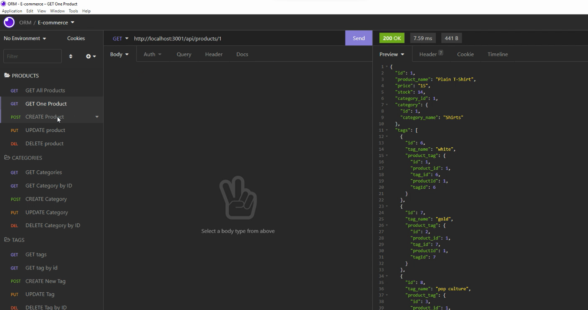

# E-commerce
 
## Description 
This is a back-end command-line E-commerce application. 
I used Node.js, Express, dotenv, Sequelize and mysql2 to develop the application.
## Usage
Users can run the command to start it up: 
`1. source schema.sql`
`2. npm run seed`
`3. npm start`
## Screenshot
 

## Links

<a href="https://drive.google.com/file/d/1h9NucOaxy6mXkrFjv-Hw8EksDJxb7TaE/view?usp=sharing">Link to the walkthrough video</a>

<a href="https://github.com/Yanbud/e-commerce">Link to the code repository</a>

## License
This project is licensed under the MIT license.
